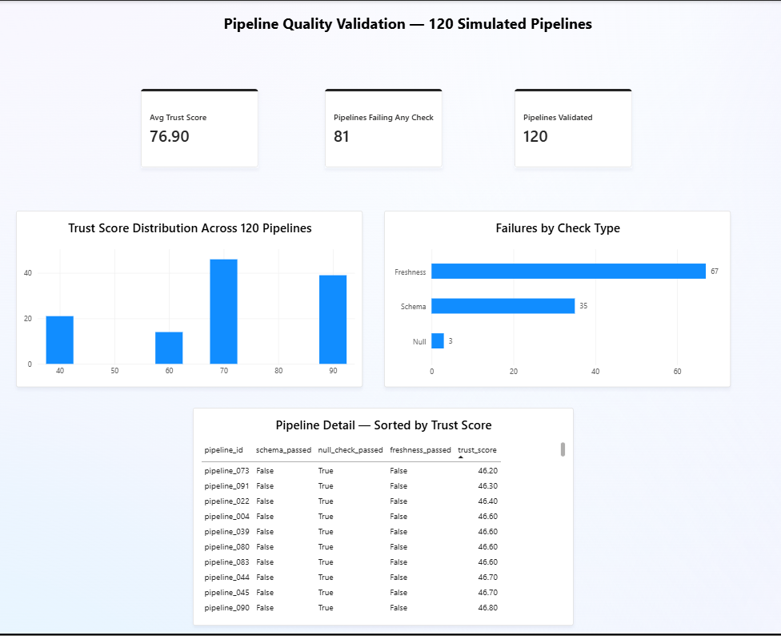

# AI-Powered Data Quality & Observability Framework

Automated data quality monitoring and NLP-based ticket classification — built with **Python, scikit-learn, PyTorch/Transformers, and Power BI**, validated on both a local environment and **Databricks**.

## Problem

Data pipelines fail silently — a renamed column, a stalled load, a burst of missing values. This project builds a lightweight observability framework that catches these failures automatically (schema validation, completeness, freshness, category drift), scores pipeline trustworthiness on a composite 0-100 scale, and pairs it with an NLP model that automatically classifies incoming support tickets by category.

Every check was validated against **known-bad data it was deliberately corrupted to detect** — not just written and assumed to work.

## Key Results

| Metric | Result |
|---|---|
| NLP classification (final model: fine-tuned DistilBERT) | **0.876 weighted F1** |
| NLP baseline (TF-IDF + Logistic Regression) | 0.863 weighted F1 |
| Pipelines validated in batch | **120** (mean trust score 76.9, 81/120 failing ≥1 check) |
| Cross-environment validation | Re-run on a real **Databricks** cluster |
| Quality checks | 4 (schema, nulls, freshness, drift) — validated against known-clean and known-corrupted fixtures |

## Architecture

- **Data source:** 47,837 IT service tickets (Kaggle), 8 categories, real class imbalance (3.7%–28.5%).
- **Quality checks (Python):** schema validation, null-rate completeness, freshness, category drift — each validated against both clean and deliberately corrupted test fixtures, then scaled to a 120-pipeline batch validation.
- **NLP classification:** a TF-IDF + Logistic Regression baseline, then a fine-tuned DistilBERT transformer, benchmarked against each other with and without class-weighting.
- **Governance:** a lineage log tracking dataset transformations (raw → cleaned → classified) and a composite trust score combining all four quality checks.
- **Cross-environment validation:** the full 120-pipeline batch validation was independently re-run on Databricks Community Edition.
- **Presentation:** a Power BI report built on the 120-pipeline results — KPI cards, trust-score distribution, failure-by-check-type breakdown, detail table.

## Two Debugging Stories

### 1. Class-weighting helps one model and hurts another — and understanding why matters

The baseline TF-IDF classifier had a real problem: its largest category (Hardware, 28.5% of the data) was acting as a "sink" — roughly twice as many misclassifications flowed *into* Hardware as flowed out, a sign of majority-class bias. `class_weight='balanced'` fixed it: minority-class recall improved substantially, at a real precision cost elsewhere.

Then the same technique was tested on a fine-tuned DistilBERT model — and it made things *slightly worse*, not better. The reason: DistilBERT's contextual embeddings already handled the minority category reasonably well without any correction, because they don't rely on raw word-frequency statistics the way TF-IDF does. Class-weighting had already-diminished value to add, and the weighted-loss version actually overfit a full epoch sooner.

**The takeaway:** class-weighting isn't a technique to apply reflexively — its value depends on whether the base model's own representation has an inherent bias worth correcting in the first place. Confirmed with TF-IDF, disconfirmed with DistilBERT — a genuine two-model comparison, not a single before/after.

### 2. A cross-environment discrepancy, diagnosed instead of dismissed

Re-running the identical 120-pipeline validation on a Databricks cluster produced a real discrepancy: 55 schema failures instead of the original 35, even with identical column names, column order, dtypes, and row counts confirmed. Rather than write it off as "just a different environment," each structural factor was checked and ruled out in sequence — landing on a **NumPy version difference** (2.2.6 locally vs. 2.1.3 on Databricks) as the actual cause: seeded random generators aren't guaranteed to produce an identical output sequence across library versions, even given the same seed.

Full write-up, including the exact diagnostic steps: [`build_guide.md`](build_guide.md), Phase 7.

## Reproducing the Dataset

This project uses the [IT Service Ticket Classification Dataset](https://www.kaggle.com/datasets/adisongoh/it-service-ticket-classification-dataset) (Kaggle, free account required). Download `it_tickets.csv` to run the notebooks.

## Tech Stack

`Python` (pandas, NumPy, scikit-learn, PyTorch, Hugging Face Transformers) `Databricks` `Power BI` `DAX`

## Notes on Methodology

Every quantitative claim in this project was validated against ground truth or a known baseline before being reported — the corrupted test fixtures have known, deliberately-injected defects; the anomaly-equivalent trust scores were checked against expected penalty math; the transformer's best checkpoint was selected by validation loss specifically to avoid reporting an overfit epoch's inflated metric. Full reasoning for every result — including the cases where a "worse" number was the correct, honest one to report — is in `build_guide.md`.
